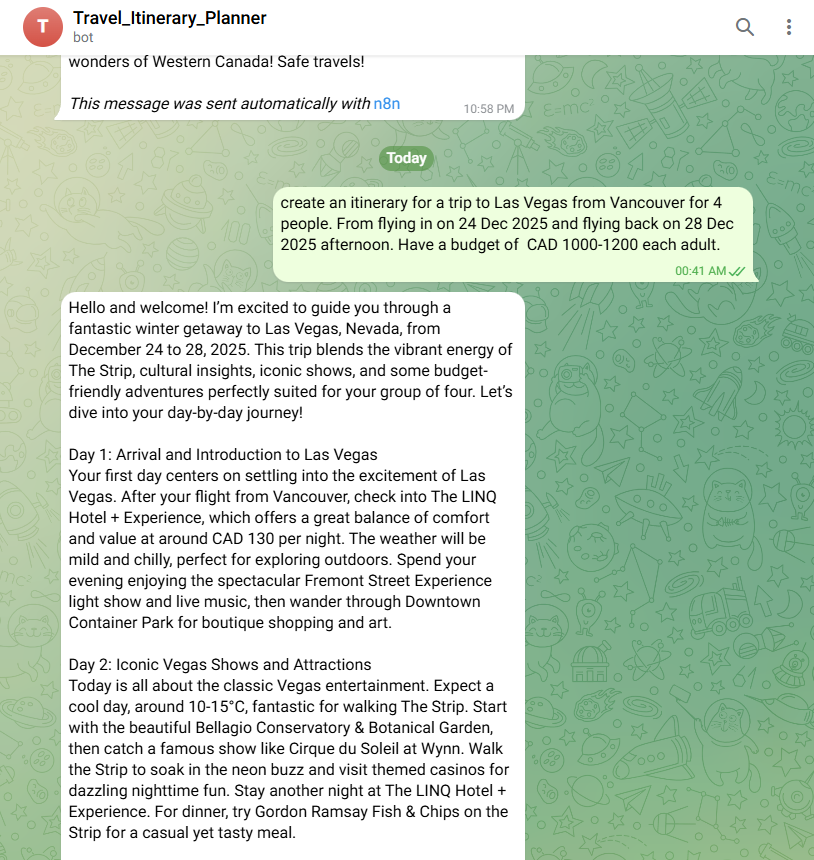
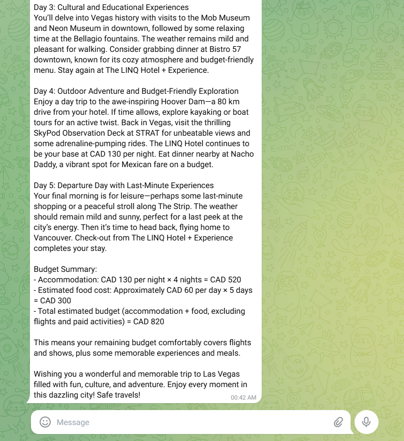

# Telegram Travel Bot Architecture

This is a comprehensive telegram multi-agent travel planning bot built on n8n that integrates seamlessly with Telegram to provide intelligent, real-time travel assistance. The bot leverages a sophisticated chain-of-thought architecture to deliver personalized travel recommendations with live data integration.

## System Overview

The bot operates as a fully automated Telegram service that processes travel requests through a multi-agent workflow, combining AI reasoning with real-time data retrieval to generate comprehensive travel plans.

## Architecture Components

### Core Workflow Agents

**1. Planning and Logistics Agent**
- Creates high-level, day-by-day itineraries based on user requests
- Handles logistics planning and trip structure
- Utilizes Chat Model and Memory for contextual planning
- Processes output through dedicated parser

**2. Live Search Agent**
- Pulls real-time information on hotels, restaurants, and weather
- Integrates with external APIs for current data
- Operates independently to gather specific travel information
- Uses dedicated output parser for structured data

**3. Reviewer Agent**
- Synthesizes all collected information into a cohesive response
- Polishes data into a single message with complete budget summary
- Accesses Chat Model and Memory for final review
- Ensures comprehensive and user-friendly output

### Output

### Supporting Infrastructure

**Models Layer**
- **GPT-4.1 Mini**: Primary language model for reasoning tasks
- **Gemini Flash 2.5**: Secondary model for enhanced capabilities
- Flexible model selection based on task requirements

**Output Processing**
- **Planning Agent Output Parser**: Structures planning agent responses
- **Live Search Agent Output Parser**: Formats search results
- **JSON Schema**: Manual validation and structure enforcement

**Memory System**
- **Agent Memory**: Centralized memory accessible to planning and review agents
- Maintains conversation context throughout the workflow
- Ensures coherent multi-turn interactions

**Tools Integration**
- **Serper Dev**: Web search capabilities via Google API
- **Search in Tavily**: Alternative search integration
- **Calculator**: Budget calculations and numerical processing

### Telegram Integration

**Input Processing**
- **Telegram Trigger**: Receives and processes incoming messages
- Handles user requests and maintains session context

**Output Delivery**
- **Send Text Message**: Delivers formatted responses back to users
- Maintains conversation flow within Telegram interface

## Requirements

### Technical Prerequisites

**n8n Platform**
- n8n cloud

**API Keys and Credentials**
- **OpenAI API Key**: For GPT-4.1 Mini access
- **Google Gemini API Key**: For Gemini Flash 2.5 model
- **Telegram Bot Token**: From BotFather for bot creation
- **Serper API Key**: For Google search integration
- **Tavily API Key**: For alternative search capabilities

## Implementation Guide

### Phase 1: Environment Setup

**1. Telegram Bot Creation**
- Message @BotFather on Telegram
- Use `/newbot` command and follow prompts
- Save the bot token securely
- Configure bot settings and permissions

### Phase 2: API Configuration

**1. OpenAI Setup**
- Create account at platform.openai.com
- Generate API key in dashboard
- Set usage limits and billing alerts

**2. Google Gemini Configuration**
- Access Google AI Studio
- Create new project and enable Gemini API
- Generate credentials and note project ID

**3. Search Service Setup**

# Serper Dev
- Register at serper.dev
- Generate API key from dashboard

# Tavily Setup
- Sign up at tavily.com
- Create API key for search integration

### Phase 3: Workflow Import and Configuration

**1. Credential Management**
Navigate to Settings > Credentials in n8n and add:
- OpenAI credentials with API key
- Google Gemini credentials
- Telegram credentials with bot token
- Serper API credentials
- Tavily API credentials

**2. Model Configuration**
- **GPT-4.1 Mini Node**: Select "gpt-4.1-mini" model
- **Gemini Flash 2.5 Node**: Configure with "gemini-flash-2.5" model
- Set appropriate temperature and token limits

## Workflow Process

1. **User Input**: Travel request received via Telegram
2. **Planning Phase**: Planning agent creates structured itinerary
3. **Data Gathering**: Live search agent collects real-time information
4. **Synthesis**: Reviewer agent combines all data into final response
5. **Delivery**: Polished travel plan sent back through Telegram

## Key Features

- **Real-time Data Integration**: Live hotel, restaurant, and weather information
- **Budget Management**: Comprehensive cost calculations and summaries
- **Contextual Memory**: Maintains conversation history for personalized responses
- **Multi-model Support**: Leverages different AI models for optimal performance
- **Telegram Native**: Seamless integration with Telegram's messaging platform

## Benefits

- **Instant Access**: Travel planning directly through Telegram
- **Current Information**: Real-time data ensures accuracy
- **Comprehensive Planning**: End-to-end travel assistance
- **Conversational Interface**: Natural language interaction
- **Budget Awareness**: Complete cost breakdown and planning

## Troubleshooting Common Issues

**Bot Not Responding**
- Verify trigger configuration
- Check API credentials validity
- Review n8n execution logs

**Search Results Incomplete**
- Validate search API keys
- Check rate limits and quotas
- Review search query formatting

**Memory Issues**
- Verify session key configuration
- Check memory node connections
- Review token limits

**Performance Issues**
- Monitor server resources
- Check API response times
- Optimize query complexity
- Review memory usage patterns

## Security Considerations

**API Key Management**
- Store keys securely in environment variables
- Rotate keys regularly
- Monitor usage for anomalies
- Implement access controls

**Data Privacy**
- Ensure user data encryption
- Implement data retention policies
- Review third-party integrations
- Maintain compliance standards

## Cost Optimization

**API Usage Management**
- Set monthly spending limits
- Monitor token consumption
- Optimize prompt efficiency
- Implement caching where possible

**Resource Allocation**
- Right-size server specifications
- Use auto-scaling when available
- Monitor bandwidth usage
- Optimize database queries

---

## License

This project is open source and available under the MIT License.

## Contributing

Contributions are welcome! Please feel free to submit a Pull Request or open an Issue for any improvements or bug fixes.

## Support

For support and questions, please refer to the n8n community forums or create an issue in the project repository.